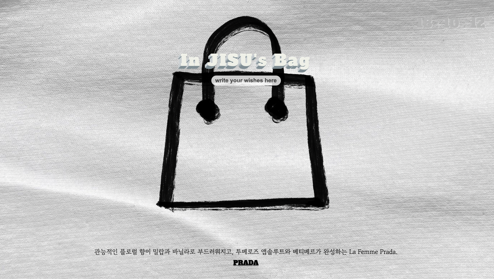

  
<h1 align="center">
  
✔️ What to Buy Today

  
</h1>

<b>나의 소비 리스트를 만들어주는 프로젝트.</b> 
<b>A project to make your own consumption list.</b>

## 👀 About

<strong>What to Buy Today</strong>는 오늘 사고 싶은 물건을 추가하거나 삭제해서 나만의 소비 리스트를 만들 수 있는 사이트입니다.  
사용자는 로그인하여 생성된 나만의 소비 가방에 리스트를 만듭니다. 무작위로 나타나는 신제품 광고를 보고 맘에 드는게 있으면 클릭해서 해당 브랜드 페이지로 이동할 수 있습니다. 반짝 세일을 놓치지 않기 위해 시계 기능까지 구현한 사이트입니다.

<strong>지금 바로 당신의 소비 리스트를 만들어보세요!🛍</strong>
